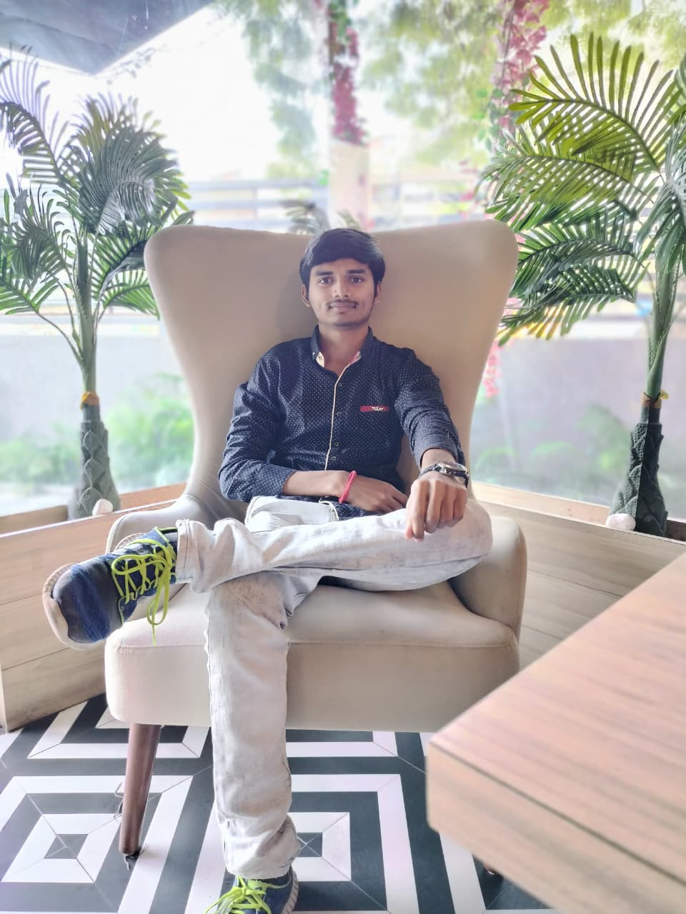
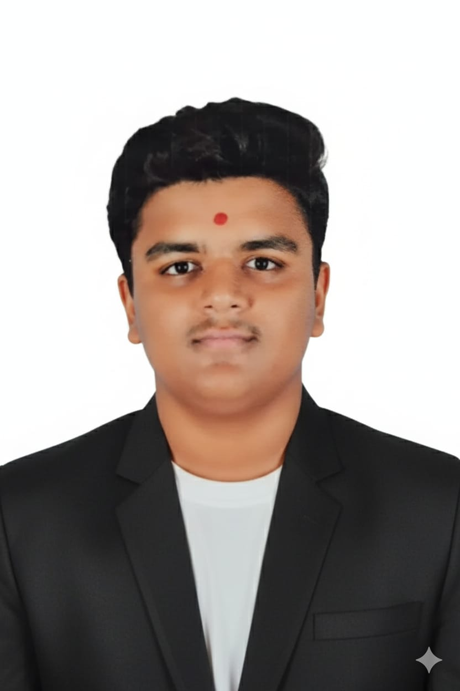
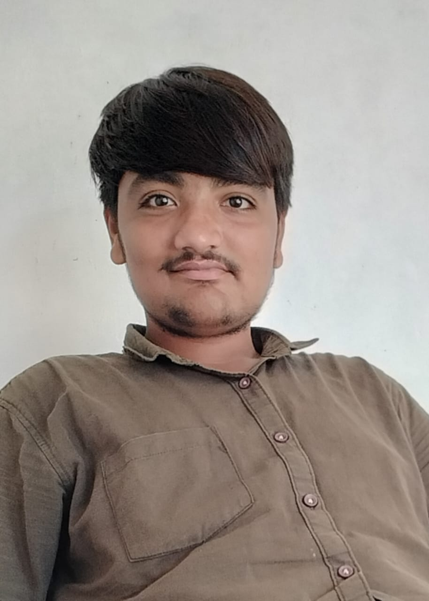

<!DOCTYPE html>
<html lang="en">
<head>
  <meta charset="UTF-8" />
  <meta name="viewport" content="width=device-width, initial-scale=1.0" />
  <title>Only For Student</title>

  
</head>

<body>
  <!-- ====== SIDEBAR ====== -->
  

    <h1>Only For Student</h1>
    <ul class="nav-links">
      <li><a href="#home">Home</a></li>
      <li><a href="#Courses/Exams">Courses</a></li>
      <li><a href="#Colleges">Colleges</a></li>
      <li><a href="#scholarship">Scholarship</a></li>
      <li><a href="#Contact">Contact</a></li>
    </ul>
  

  <!-- ====== MAIN CONTENT ====== -->
  

    <section id="home">
      <h2>Welcome</h2>
      
Welcome to <b>Only For Student</b> — your one-stop platform for Gujarat students after 12th. Explore courses, government colleges, scholarships, eligibility criteria, and application links — all in one place.

    </section>

    <section id="Courses/Exams">
      <h2>Courses/Exams</h2>
      
Explore B.Tech, BE, M.Tech, ME, and Diploma engineering programs in Gujarat.

    </section>

   <section id="Colleges">
      <h2>College Section</h2>
      
Click on a College title to view full details:

	  
      

        <button class="toggle-btn" onclick="toggleDetails(this)">
          Lalbhai Dalpatbhai College of Engineering
        </button>
        

          
<b>Link:</b> 
            <a href="http://ldce.ac.in/" target="_blank">
              L. D. College of Engineering
            </a>
          

          
<b>Fee Structure</b>

          <ul>
            <li>Boy:1500+college Stationary fee</li>
            <li>Girls:College Stationary Fee</li>
            <li>few student: only College Stationary Fee</li>
          </ul>

          
<b>Branch</b>

          <ul>
            <li>Computer Science</li>
            <li>Civil Engineering</li>
            <li>Meachanical Engineering</li>
            <li>Electrical Engineering</li>
            <li>Rubber Engineering</li>
 	    <li>AIML Engineering</li>
	    <li>EC Engineering</li>
	    <li>More</li>
          </ul>

          
<b>feedback</b>

          <ul>
            <li>Campus big</li>
            <li>Placement good</li>
            <li>large activitys</li>
            <li>many culture Program</li>
            <li>Many visits</li>
          </ul>
        

      

	  <!-- College 2 -->
      

        <button class="toggle-btn" onclick="toggleDetails(this)">
           Government Engineering College (GEC), rajkot
        </button>
        

          
<b>Link:</b> 
            <a href="https://gecrajkot.ac.in/" target="_blank">
            https://gecrajkot.ac.in/
            </a>
          

          
<b>Fee Structure</b>

          <ul>
            <li>Boy:1500+college Stationary fee</li>
            <li>Girls:College Stationary Fee</li>
            <li>few student: only College Stationary Fee</li>
          </ul>

          
<b>Branch</b>

          <ul>
            <li>Automobile Engineering </li>
            <li>Information Technology (IT)</li>
            <li>Civil Engineering</li>
            <li>Electrical Engineering</li>
            <li>Rubber Engineering</li>
 	    <li>AIML Engineering</li>
	    <li>EC Engineering</li>
	    <li>More</li>
          </ul>

          
<b>feedback</b>

          <ul>
            <li>Good infrastructure,</li>
            <li>many culture Program</li>
            <li>best feculty</li>
            <li>helpful feculty</li>
            <li>Many visits</li>
          </ul>
        

      

	  <!-- College 3 -->
      

        <button class="toggle-btn" onclick="toggleDetails(this)">
          Government Engineering College (GEC), Bhavnagar
        </button>
        

          
<b>Link:</b> 
            <a href="https://gecbhavnagar.ac.in/" target="_blank">
           https://gecbhavnagar.ac.in/
            </a>
          

          
<b>Fee Structure</b>

          <ul>
            <li>Boy:1500+college Stationary fee</li>
            <li>Girls:College Stationary Fee</li>
            <li>few student: only College Stationary Fee</li>
          </ul>

          
<b>Branch</b>

          <ul>
            <li>Electronics & Communication Engineering </li>
            <li>production Engineering</li>
            <li>biosystem Engineering</li>
            <li>Electrical Engineering</li>
            <li>Rubber Engineering</li>
 	    <li>AIML Engineering</li>
	    <li>EC Engineering</li>
	    <li>More</li>
          </ul>

          
<b>feedback</b>

          <ul>
            <li>qualified & helpful feculty</li>
            <li>Better placements in CSE/IT branches</li>
            <li>Hostel & canteen facilities average</li>
            <li>many culture Program</li>
            <li>Many visits</li>
          </ul>
        

      

	  <!-- College 4 -->
      

        <button class="toggle-btn" onclick="toggleDetails(this)">
          Government engineering college gandhinagar
        </button>
        

          
<b>Link:</b> 
            <a href="https://www.gecg28.ac.in/cells/14/" target="_blank">
              GEC Gandhinagar 
            </a>
          

          
<b>Fee Structure</b>

          <ul>
            <li>Boy:1500+college Stationary fee</li>
            <li>Girls:College Stationary Fee</li>
            <li>few student: only College Stationary Fee</li>
          </ul>

          
<b> Bachelour of Engineering Branch</b>

          <ul>
            <li>Computer Science</li>
            <li>Civil Engineering</li>
            <li>Meachanical Engineering</li>
            <li>Electrical Engineering</li>
            <li>Rubber Engineering</li>
 	    <li>AIML Engineering</li>
	    <li>EC Engineering</li>
	    <li>Biomedical Engineering</li>
        <li>Metallurgy Engineering</li>
	
<b> master  of Engineering Branch</b>

        <li>Biomedical  Engineering</li>
        <li>computer  Engineering</li>
          </ul>
          
<b>feedback</b>

          <ul>
            <li>Campus big</li>
            <li>Placement good</li>
            <li>large activitys</li>
            <li>many culture Program</li>
            <li>Many visits</li>
          </ul>
        

      

	  
	  <!-- College 5 -->
	  

        <button class="toggle-btn" onclick="toggleDetails(this)">
          Vishwakarma Government engineering college
        </button>
        

          
<b>Link:</b> 
            
          

          
<b>Fee Structure</b>

          <ul>
            <li>Boy:1500+college Stationary fee</li>
            <li>Girls:College Stationary Fee</li>
            <li>few student: only College Stationary Fee</li>
          </ul>
          
<b>Branch</b>

          <ul>
            <li>Computer Science</li>
            <li>Civil Engineering</li>
            <li>Mechanical Engineering</li>
            <li>Electrical Engineering</li>
            <li>Rubber Engineering</li>
 	    <li>AIML Engineering</li>
	    <li>EC Engineering</li>
	    <li>textile enginnering</li>
          </ul>
          
<b>feedback</b>

          <ul>
            <li>Campus big</li>
            <li>Placement good</li>
            <li>large activitys</li>
            <li>many culture Program</li>
            <li>Many visits</li>
          </ul>
        

      

	  <!-- College 6 -->
      

        <button class="toggle-btn" onclick="toggleDetails(this)">
          The Maharaja Sayajirao University of Baroda
        </button>
        

          
<b>Link:</b> 
            <a href="https://msubaroda.ac.in/" target="_blank">
            https://msubaroda.ac.in/
            </a>
          

          
<b>Fee Structure</b>

          <ul>
            <li>Boy:1500+college Stationary fee</li>
            <li>Girls:College Stationary Fee</li>
            <li>few student: only College Stationary Fee</li>
          </ul>

          
<b>Branch</b>

          <ul>
            <li>chemical Engineering </li>
            <li>textile Engineering</li>
            <li>biosystem Engineering</li>
            <li>Electrical Engineering</li>
            <li>Rubber Engineering</li>
 	    <li>AIML Engineering</li>
	    <li>EC Engineering</li>
	    <li>More</li>
          </ul>

          
<b>feedback</b>

          <ul>
            <li>good enviroment</li>
            <li>Placement good</li>
            <li>best feculty</li>
            <li>many culture Program</li>
            <li>Many visits</li>
          </ul>
        

      

    </section>

     <!-- ====== SCHOLARSHIP SECTION ====== -->
    <section id="scholarship">
      <h2>Scholarship Section</h2>
      
Click on a scholarship title to view full details:

      <!-- Scholarship 1 -->
      

        <button class="toggle-btn" onclick="toggleDetails(this)">
          Mukhyamantri Yuva Swavalamban Yojana (MYSY)
        </button>
        

          
<b>Link:</b> 
            <a href="https://www.myscheme.gov.in/schemes/mysy" target="_blank">
              https://www.myscheme.gov.in/schemes/mysy
            </a>
          

          
<b>Expected Amount:</b>

          <ul>
            <li>₹50,000 tuition fee grant for BE/B.Tech</li>
            <li>₹25,000 tuition fee grant for Diploma</li>
            <li>₹5,000 book/instrument grant for engineering courses</li>
            <li>₹3,000 for diploma students</li>
            <li>₹1,200/month hostel grant for away-from-home students</li>
          </ul>

          
<b>Eligibility:</b>

          <ul>
            <li>Must be from Gujarat</li>
            <li>For Diploma: Class X with ≥80%</li>
            <li>For Degree: Class XII with ≥80%</li>
            <li>For Diploma to Degree: Diploma ≥65%</li>
            <li>Family income ≤ ₹6,00,000</li>
          </ul>

          
<b>Documents Required:</b>

          <ul>
            <li>Income Certificate</li>
            <li>Self-Declaration Form</li>
            <li>Aadhaar Card</li>
            <li>10th & 12th Mark Sheets</li>
            <li>Institute Certificate</li>
            <li>Admission Letter & Fee Receipt</li>
            <li>Non-judicial Affidavit (₹20)</li>
            <li>Hostel Admission Letter (if applicable)</li>
          </ul>
        

      

      <!-- Scholarship 2 -->
      

        <button class="toggle-btn" onclick="toggleDetails(this)">
         Digital Gujarat
        </button>
        

          
<b>Link:</b> 
            <a href="[https://www.myscheme.gov.in/schemes/mysy](https://www.digitalgujarat.gov.in)" target="_blank">
             [ https://www.myscheme.gov.in/schemes/mysy](https://www.digitalgujarat.gov.in)
            </a>
          

          
<b>Eligibility Criteria:</b>

          <ul>
            <li>Must be a resident of Gujarat</li>
            <li>Must belong to SC/ST/OBC/EBC/Minority/Physically Disabled category</li>
            <li>Must be studying in a recognized college or university (in Gujarat or outside Gujarat)</li>
            <li>Annual family income limit (from all sources):
            SC/ST: ≤ ₹2,50,000
            OBC/EBC: ≤ ₹1,50,000 (rural) or ₹1,20,000 (urban)
            Minority: ≤ ₹2,00,000</li>
            <li>Must have passed the previous examination with at least 50% markss</li>
          </ul>

          
<b>Documents Required:</b>

          <ul>
            <li>Income Certificate</li>
            <li>Passport Size Photoes</li>
            <li>Self-Declaration Form</li>
            <li>Caste Certificate</li>
            <li>Aadhaar Card</li>
            <li>10th & 12th Mark Sheets</li>
            <li>Institute Certificate</li>
            <li>Admission Letter & Fee Receipt</li>
            <li>Non-judicial Affidavit (₹20)</li>
            <li>Hostel Admission Letter (if applicable)</li>
          </ul>

          
<b>Application Timeline (Usually):</b>

         <ul>
         <li>Opens: June–August every year</li>
         <li>Last Date: October–November (varies yearly)</li>
          </ul>
          

        

        <!-- Scholarship 3 -->
      

    <button class="toggle-btn" onclick="toggleDetails(this)">
      Reliance Foundation Scholarship
    </button>
    

      
<b>Link:</b> 
        <a href="https://www.reliancefoundation.org/education/scholarships" target="_blank">
          https://www.reliancefoundation.org/education/scholarships
        </a>
      

    
<b>Expected Amount:</b>

    <ul>
      <li>Up to ₹2,00,000 per year for Undergraduate students</li>
      <li>Up to ₹6,00,000 total for Postgraduate students</li>
      <li>Additional mentorship, networking, and leadership training benefits</li>
    </ul>

    
<b>Eligibility Criteria:</b>

    <ul>
      <li>Must be an Indian citizen</li>
      <li>Must be enrolled in a recognized undergraduate or postgraduate program in India</li>
      <li>For UG: Must have passed Class 12 with at least 60% marks</li>
      <li>For PG: Must have completed a relevant undergraduate degree with good academic record</li>
      <li>Family income must be ≤ ₹15,00,000 per annum (priority for ≤ ₹2,50,000)</li>
      <li>Selection based on merit and aptitude test performance</li>
    </ul>

    
<b>Documents Required:</b>

    <ul>
      <li>Aadhaar Card</li>
      <li>Class 10th & 12th Mark Sheets</li>
      <li>Income Certificate</li>
      <li>Bonafide Certificate from current institute</li>
      <li>Recent Passport-size Photograph</li>
      <li>Bank Account Proof (student’s name printed)</li>
      <li>Academic transcripts (UG/PG as applicable)</li>
    </ul>

    
<b>Application Timeline:</b>

    <ul>
      <li>Opens: August every year</li>
      <li>Closes: Around October</li>
    </ul>

    
<b>Selection Process:</b>

    <ul>
      <li>Online application submission</li>
      <li>Aptitude test (online)</li>
      <li>Personal interview (for shortlisted candidates)</li>
    </ul>
      

    

    <!-- Scholarship 4 -->
    

      <button class="toggle-btn" onclick="toggleDetails(this)">
        NSP Post-Matric Scholarship (SC/ST/OBC)
      </button>
      

        
<b>Link:</b> 
          <a href="https://scholarships.gov.in" target="_blank">
            https://scholarships.gov.in
          </a>
        

    
<b>Expected Amount:</b>

    <ul>
      <li>₹3,000 to ₹12,000 per year (depending on category & course)</li>
      <li>Full or partial tuition fee reimbursement</li>
      <li>Hostel maintenance allowance: ₹1,200/month</li>
    </ul>

    
<b>Eligibility Criteria:</b>

    <ul>
      <li>Must belong to SC/ST/OBC category</li>
      <li>Studying in Class 11 or higher (recognized institution)</li>
      <li>Annual family income ≤ ₹2,50,000 (SC/ST) or ₹1,50,000 (OBC)</li>
    </ul>

    
<b>Documents Required:</b>

    <ul>
      <li>Caste Certificate</li>
      <li>Income Certificate</li>
      <li>Bonafide Certificate</li>
      <li>Mark Sheets (previous exam)</li>
      <li>Aadhaar Card</li>
      <li>Bank Passbook copy</li>
    </ul>
    

      

  <!-- Scholarship 5 -->
    

      <button class="toggle-btn" onclick="toggleDetails(this)">
        AICTE Pragati Scholarship for Girls
      </button>
      

        
<b>Link:</b> 
          <a href="https://www.aicte-pragati-saksham-gov.in" target="_blank">
            https://www.aicte-pragati-saksham-gov.in
          </a>
        

    
<b>Expected Amount:</b>

    <ul>
      <li>₹50,000 per annum for tuition fees</li>
      <li>Additional ₹2,000 per month for 10 months (book allowance)</li>
      <li>Valid for up to 4 years (UG) or duration of course</li>
    </ul>

    
<b>Eligibility Criteria:</b>

    <ul>
      <li>Girl student admitted to AICTE-approved technical institution</li>
      <li>Family income ≤ ₹8,00,000 per annum</li>
      <li>Maximum two girls per family eligible</li>
    </ul>

    
<b>Documents Required:</b>

    <ul>
      <li>Aadhaar Card</li>
      <li>Family Income Certificate</li>
      <li>Admission proof (AICTE-approved institute)</li>
      <li>10th & 12th Mark Sheets</li>
      <li>Bank Account details</li>
      <li>Bonafide Certificate from Institute</li>
    </ul>
      

    

<!-- Scholarship 7 -->
    

      <button class="toggle-btn" onclick="toggleDetails(this)">
        ONGC Foundation Scholarship (For Engineering Students)
      </button>
    
      

        
<b>Link:</b> 
          <a href="https://www.ongcfoundation.org/scholarship" target="_blank">
            https://www.ongcfoundation.org/scholarship
          </a>
        

    
<b>Expected Amount:</b>

    <ul>
      <li>₹48,000 per year for 4 years (Total ₹1,92,000)</li>
      <li>For full-time Engineering (B.E./B.Tech) students in India</li>
      <li>Scholarship paid annually directly to student’s bank account</li>
    </ul>

    
<b>Eligibility Criteria:</b>

    <ul>
      <li>Must be an Indian citizen and a resident of Gujarat</li>
      <li>Studying in the first year of Engineering (AICTE-approved institute)</li>
      <li>Minimum 60% marks in Class 12 (PCM group)</li>
      <li>Family annual income limit:
        <ul>
          <li>SC/ST category: ≤ ₹4,50,000</li>
          <li>OBC/General category: ≤ ₹2,00,000</li>
        </ul>
      </li>
      <li>Age below 30 years as of 31st December of the academic year</li>
      <li>Selection based purely on merit and eligibility</li>
    </ul>

    
<b>Documents Required:</b>

    <ul>
      <li>Aadhaar Card</li>
      <li>Income Certificate (issued by competent authority)</li>
      <li>Caste Certificate (if applicable)</li>
      <li>10th & 12th Mark Sheets</li>
      <li>Admission Letter / Fee Receipt</li>
      <li>Bonafide Certificate from Institute</li>
      <li>Bank Passbook copy (student’s name must be printed)</li>
      <li>Passport-size Photograph</li>
    </ul>

    
<b>Application Timeline:</b>

    <ul>
      <li>Usually opens: October – November</li>
      <li>Last date: December (varies each year)</li>
      <li>Apply through ONGC Foundation official website</li>
    </ul>

    
<b>Selection Process:</b>

    <ul>
      <li>Online application submission via ONGC Foundation portal</li>
      <li>Shortlisting based on academic performance and income</li>
      <li>Verification and approval by ONGC Foundation committee</li>
    </ul>
      

    

        </section>

    <section id="Contact">
      <h2>Our Team</h2>
      
Meet the <b>Only For Student</b> team — helping Gujarat students with all opportunities in one place.

      

        

          
          <h3>Krish Dodiya</h3>
          
Developer

          
📞 +91 98765 41070

          
✉️ 24eedod@ldce.ac.in

        

        

          
          <h3>Abhishek Makwana</h3>
          
Creator

          
📞 +91 93160 27621

          
✉️ 24eeabh@ldce.ac.in

        

        

          
          <h3>Naman Chauhaan</h3>
          
Researcher + Designer

          
📞 +91 98245 11234

          
✉️ 24eenam@ldce.ac.in

        

        

          
          <h3>Jaydeep Makvana</h3>
          
Researcher

          
📞 +91 98765 55678

          
✉️ 24eejay@ldce.ac.in

        

      

    </section>
  

  
</body>
</html>
